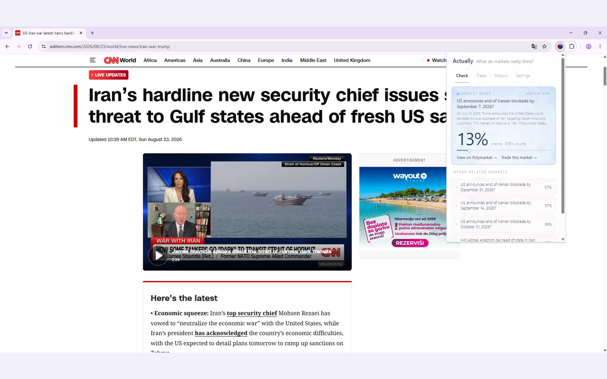
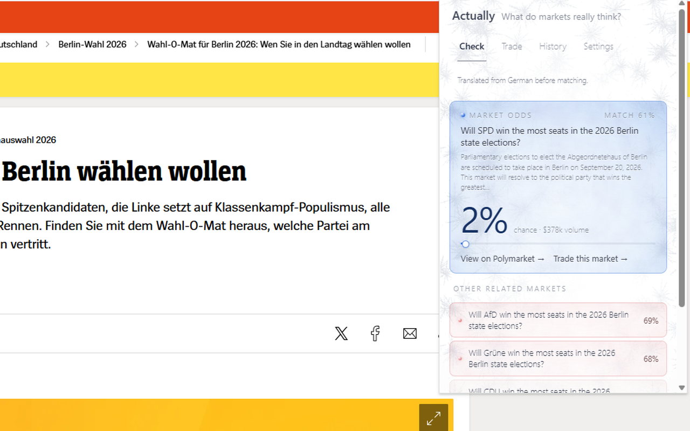

# Actually - What Markets Really Think

A Chrome extension and an MCP server that put prediction-market odds on top of
the news you are already reading.

News tells you that "experts are concerned" or that "odds are rising". It
rarely tells you a number. The number exists - on a prediction market, where
people are betting their own money on the outcome. It just lives in another
tab, and finding it means knowing such a market exists in the first place.

Actually closes that gap. Open an article, click the toolbar icon, and the
extension matches the text against live Polymarket markets and shows the
market's own probability. No account, no wallet, no signup.



## What it does

- **Matches an article to a market.** A local embedding model
  (`Xenova/all-MiniLM-L12-v2`, ~33 MB) scores the article text against the
  cached market set, boosted by keyword and number overlap - numbers matter
  because the encoder is nearly blind to them, and "dip to $57,500" embeds
  almost identically to "reach $120,000".
- **Runs on your device.** Model and WASM runtime are bundled at build time -
  nothing is fetched from a CDN at install or runtime, and on the default
  settings the article text never leaves the machine.
- **Reads non-English pages.** They are translated to English before matching,
  using Chrome's own built-in `Translator` API (local, no network). Every
  Polymarket question is written in English, and the local model holds 86
  Cyrillic tokens out of 30522 - an untranslated Russian headline embeds to
  noise. Translated, the same headline scores 0.53-0.71 against the market it
  is actually about, against a 0.35 floor.

  
- **Trades, optionally.** Connect any WalletConnect v2 wallet for limit and
  market orders, selling, cancelling resting orders, and a positions panel with
  cost basis and P&L. Keys and funds are never held by us.
- **Serves agents too.** The same capabilities are exposed over the Model
  Context Protocol: `check_news`, `get_market`, `place_order`, `sell_order`,
  `cancel_order`, `get_positions`.

## Using the MCP server

The MCP server is published, so it needs no clone and no build. Add it to any
MCP client (Claude Desktop, Cursor, and anything else that speaks the
protocol):

```json
{
  "mcpServers": {
    "actually": {
      "command": "npx",
      "args": ["actually-mcp-server"]
    }
  }
}
```

That gives an agent the signal tools - `check_news` and `get_market` - with no
key and no wallet. Ask it "what do markets think about this?" with a headline
and it answers with the market's own price.

Trading tools appear only if you supply a key of your own:

```json
"env": {
  "POLYMARKET_PRIVATE_KEY": "0x...",
  "ACTUALLY_MAX_ORDER_USD": "100",
  "ACTUALLY_DAILY_LIMIT_USD": "500"
}
```

Both caps are enforced server-side against a persisted spend ledger, so an
agent cannot talk its way past them by claiming a different price.
`redeem_position` needs a further explicit opt-in
(`ACTUALLY_ENABLE_REDEEM=true`) because it submits a real on-chain transaction
and is still in testing.

Full documentation, including every environment variable and the reasoning
behind the guards: [`packages/mcp-server/README.md`](packages/mcp-server/README.md).

Listed in the [official MCP registry](https://registry.modelcontextprotocol.io/v0/servers?search=io.github.Sofiia7/actually)
as `io.github.Sofiia7/actually`, on mcpservers.org, and on Glama:

[](https://mcpservers.org/servers/sofiia7/actually)

[](https://glama.ai/mcp/servers/Sofiia7/actually)

## How it fits together

```
extension/            Chrome MV3 extension (React popup, offscreen document)
extension/worker/     Cloudflare Worker - API proxy, rate limiting, market cache
packages/core/        Matching, pricing and Polymarket API logic, shared by both clients
packages/mcp-server/  MCP server, published to npm as actually-mcp-server
packages/market-cache-builder/   Cron job that precomputes the market embeddings
```

The heavy work lives in an **offscreen document** because MV3 service workers
cannot run WASM, hold a WebSocket, or survive long enough to sign an order.

The **market cache** is 2000 open markets with precomputed embeddings, rebuilt
every two hours. Selection blends three orderings - 24h volume, lifetime
volume, and recency - because ranking by lifetime volume alone is the wrong
shelf for a news tool: a market opened this morning under today's headline has
no history and loses to a year-old election market every time.

The **Worker** exists so no client has to hold a credential. It proxies
Polymarket's APIs, serves the precomputed cache, and acts as a remote signer
for the relayer, so the builder credential stays on the server and never ships
inside an extension.

## Running it

```bash
npm install
npm run models:fetch -w extension   # bundle the embedding model
npm run build -w extension          # type-check + build to extension/dist
```

Load `extension/dist` as an unpacked extension in Chrome. Copy
`extension/.env.example` to `.env.local` and fill it in first - the build bakes
the Worker URL, the WalletConnect project id and the builder code.

```bash
npm test --workspaces               # 686 tests across four workspaces
```

## Privacy

Discovery is free and needs no account. There are no content scripts: the page
is read only when you click, and only the active tab. On the default settings
(local embeddings, translation off-device) the article text does not leave your
machine. Telemetry is opt-in and off by default.

Full policy: https://actually-api.sofiaseremeteva.workers.dev/privacy

## Status

The extension is built and passing its release gates; the Chrome Web Store
submission is in progress. `actually-mcp-server` is published on npm and listed
in the official MCP registry.

Redeeming a resolved position is **in testing**: builder authentication,
neg-risk contract selection and the zero-balance guard are each verified
against live services, but no redeem has yet been observed collecting funds end
to end.

Trading is unavailable in several jurisdictions (US, GB, FR, BE, AU, SG, TH,
TW, PL, and sanctioned countries), enforced Worker-side. Viewing odds works
everywhere.

Actually does not provide financial advice.

## License

See [LICENSE](LICENSE).
